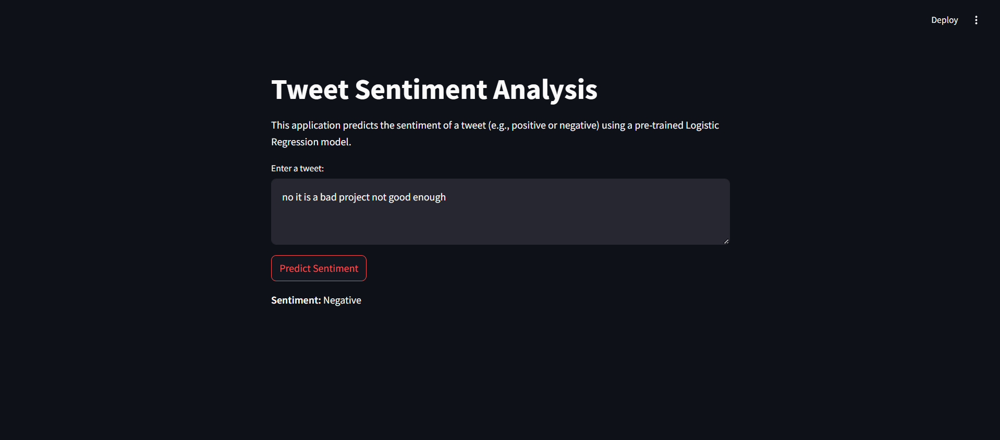
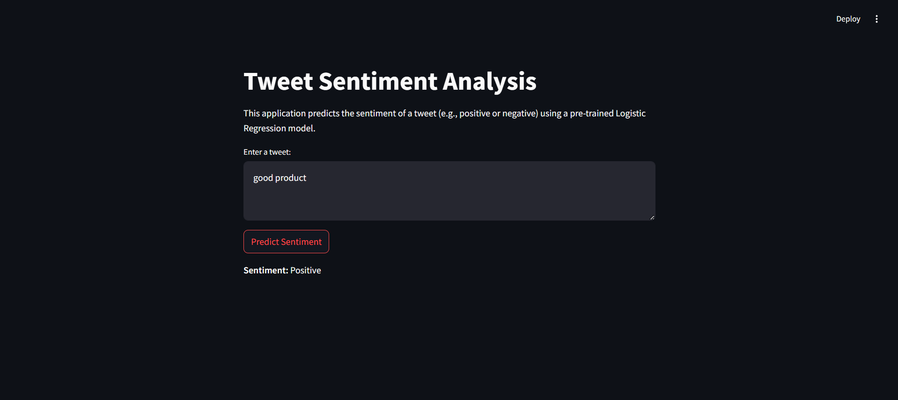

# Sentiment Analysis of Tweets

## Overview
This project demonstrates a Sentiment Analysis application that predicts whether a given tweet expresses a positive or negative sentiment. It uses a trained Logistic Regression model and deploys it through an interactive Streamlit application. The project focuses on text preprocessing, model training, and user-friendly deployment.

## Key Highlights:
- Predict tweet sentiment as Positive or Negative.
- User-friendly interface for seamless interaction.
- Accurate predictions using state-of-the-art TF-IDF Vectorizer and Logistic Regression.

## Use Case
For instance, a tweet like: "Absolutely loved the new features in the product! Amazing work."
would be classified as Positive by the model.

## Features
- Input: Enter a tweet in the text box provided in the app.
- Real-Time Prediction: Predicts whether the tweet sentiment is Positive or Negative.
- Interactive UI: Developed using Streamlit, offering a simple and intuitive interface.

## Dataset Description
The dataset, sourced from Kaggle, contains labeled tweets for sentiment analysis:

- Text Data: Tweets provided as input.
- Sentiment Labels: Binary labels (0 for Negative, 1 for Positive).

## Project Workflow
1. **Data Preprocessing**:
- Remove special characters and noise.
- Convert text to lowercase.
- Perform stemming for normalization.
2. **Model Training**:
- Algorithm: Logistic Regression.
- Feature Engineering: TF-IDF Vectorization for converting text into numerical features.
- Evaluation: Achieved high accuracy on both training and testing datasets.
3. **Deployment**:
- Streamlit-based app for real-time sentiment analysis.

## Files Description
- **app.py**: Main Streamlit application file for the prediction interface.
- **trained_model.sav**: Pre-trained Logistic Regression model.
- **weets.csv**: Preprocessed dataset used for model training.
- **requirements.txt**: List of Python packages required for the project.

## Visuals
Screenshot of the Application

## Model Performance
- Training Accuracy: 79%
- Testing Accuracy: 77%
- Precision & Recall: High performance across both metrics ensures balanced predictions.

## Future Enhancements

- Expand Dataset: Incorporate more diverse tweets for better predictions.
- Multilingual Support: Enable sentiment analysis for tweets in multiple languages.
- Advanced Models: Experiment with deep learning models like LSTMs and BERT.
- Visualization: Add charts to show sentiment trends over time.

## Technologies Used
- **Python**: Programming language for model development.
- **Streamlit**: Framework for deploying the application.
- **scikit-learn**: Library for machine learning algorithms.
- **Pandas**: Data manipulation and preprocessing.
- **NumPy**: Numerical operations.
- **NLTK** : Natural Language Processing for text preprocessing.

# Conclusion:

This Sentiment Analysis project offers an insightful approach to understanding user opinions and emotions from text data. By utilizing natural language processing (NLP) techniques, including tokenization, lemmatization, and the application of machine learning algorithms, the system effectively classifies sentiment into categories such as positive, negative, or neutral. The use of pre-trained models like Word2Vec or TF-IDF, combined with an intuitive user interface built with tools like Streamlit, ensures a seamless experience for analyzing sentiment across different textual inputs.

The project showcases the power of text preprocessing and sentiment classification models in extracting meaningful insights from raw data, making it a valuable tool for businesses or individuals looking to analyze customer feedback, reviews, or social media content. By leveraging modern NLP techniques and machine learning models, it provides a solid foundation for further improvements, such as incorporating more advanced techniques like deep learning, transfer learning, or sentiment trend analysis.

With further enhancements, this sentiment analysis system can be expanded to analyze more complex text data, incorporate contextual analysis, or offer more granular sentiment categories, thus paving the way for more accurate, real-time sentiment monitoring across various domains.
